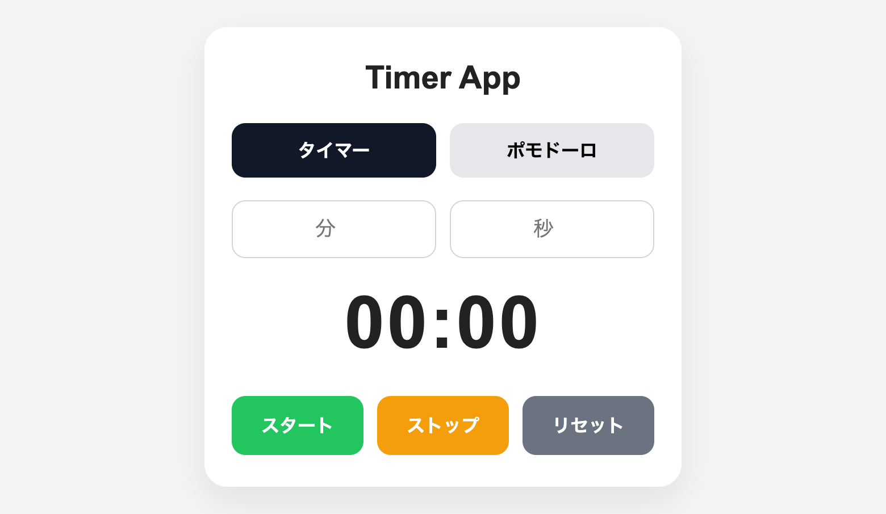
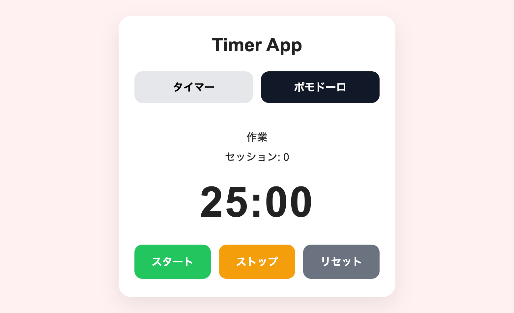

# Timer App
シンプルなタイマー＆ポモドーロタイマーアプリです。
HTML/CSS/JavaScriptのみで構成されています。

## スクリーンショット
### タイマー

### ポモドーロ

## デモ
https://rikusugihara.github.io/timer-app/

## 機能
### タイマー機能
- 分・秒を入力してカウントダウン
- スタート/ストップ/リセット
- 終了時にアラーム音＋アラート表示

### ポモドーロ機能
- 作業（25分）/休憩（5分）を自動切替
- セッション回数のカウント
- モードに応じた背景色の変化
  - 作業 → 赤系
  - 休憩 → 青系
 
### 共通機能
- タブ切替（タイマー/ポモドーロ）
- 一時停止 → 再開が可能
- 残り時間を正確に管理（Date.nowベース）

## 使用技術
- HTML
- CSS
- JavaScript

## 使用方法
1. index.htmlをブラウザで開く
2. タブを選択
  - タイマー
  - ポモドーロ
3. 「スタート」で開始

## 注意点
- music/alarm.mp3が必要です
- ブラウザによっては音声再生にユーザー操作が必要です

## 工夫ポイント
- remainingTime + startTimeによるズレないタイマー設計
- UI状態とロジックの分離
- タブごとの表示切替
- クラス切替による背景デザイン変更

## 今後の改善策
- ポモドーロ時間のカスタマイズ
- 通知API対応
- ローカルストレージ保存
- ダークモード

## 作成者
GitHub https://github.com/rikusugihara
